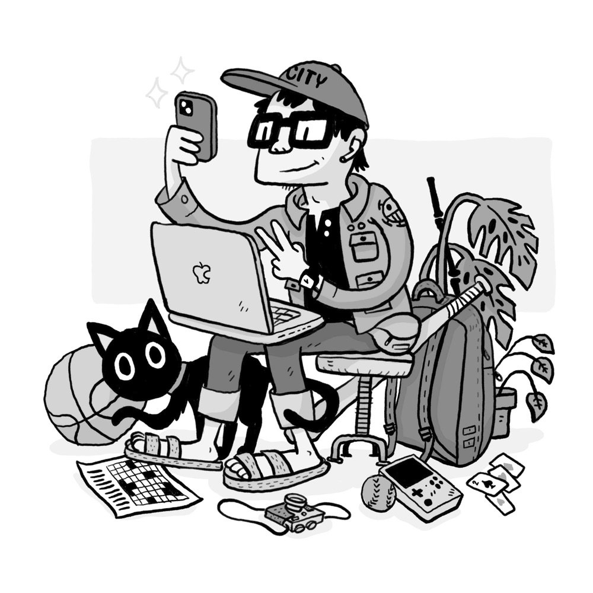

<h1>Hi, I'm Ray 👋  
Designer & Illustrator</h1>

## Currently
- Constructing <a href='nyt-connections'>Connections</a> puzzles
- Playing around with PICO-8
- Building an <a href='https://promptdesignart.etsy.com' target='_blank'>Etsy biz</a> with AI generated art
- Helping a friend with her <a href='https://www.adelle.ink' target='_blank'>live painting</a> business and website
- Learning conversational Cantonese
- Growing lemon trees and propagating monstera plants

<ul class='current-media'>
	<li>🎮 Dicey Dungeons
	<li>🎮 Connections
	<li>🎧 Video Game Instrumentals
	<li>📺 Julia!
	<li>📚 Mob Psycho 100
</ul>

## Past
- Participated in <a href='inktober-2023'>Inktober</a>! 
- Went to NOLA in April, NYC in June
- Illustrated 2 children's books, Tiger Tiger and <a href="https://rayuen.com/v1/monkey-mo" target='_blank'>Monkey Mo</a>
- Drew caricatures at Six Flags Great Adventure
- Made <a href='http://darth-pickle.nfshost.com/' target='_blank'>Darth Pickle</a>, where I host code projects
- Studied Graphic Design at Rochester Institute of Technology
- Grew up in NJ, lived in Rochester and Brooklyn
- Can solve a Rubik's Cube >1m
- Pandemic hobby: sewing pouches

Updated: Dec 2023

<picture class='portrait'>
	<!-- <source srcset='images/src/portrait/portrait@3x.webp 3x' type='image/webp' media='(min-width: 1200px)'> -->
	
</picture>